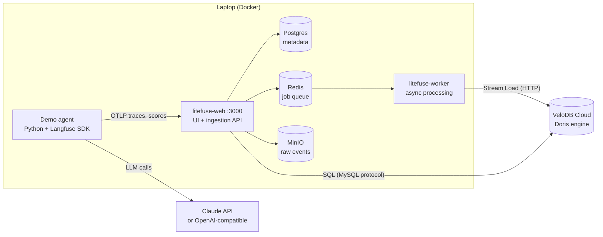
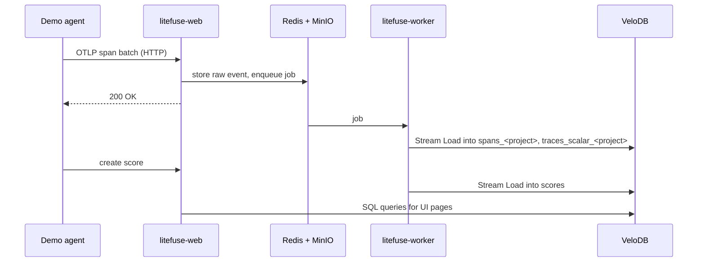

# Litefuse + VeloDB Agent Observability Demo — Design

Sep 25, 2026 · @Wang Jiannan

## Overview

This demo runs a tool-using customer-support agent, traces and evaluates it with Litefuse, and stores all trace, score and experiment data in a VeloDB Cloud warehouse. It shows that a Langfuse-compatible observability platform can run on VeloDB instead of ClickHouse, with the official Langfuse SDK unchanged.

**Audience:** teams building LLM agents who need tracing, evaluation and long-term analytics on agent data.

**What it proves:**

- Every agent step (model call, tool call, tokens, cost, errors) is captured as a trace tree and queryable in VeloDB over the MySQL protocol.
- Online signals (user thumbs, session resolution, policy-violation flags) and offline experiments (a 15-case golden dataset, rule-based checks plus an LLM judge) sit side by side.
- A prompt change can be proven better before it ships: with Claude Haiku 4.5 as the agent, prompt v2 lifted policy compliance from 0.80 to 1.00 (measured 25 Sep 2026, before the 7 Oct dataset changes; see [Measured result](#offline-golden-dataset-and-experiments)).

**Non-goals:** production hardening, multi-tenant setup, or benchmarking VeloDB against ClickHouse. The store backend is mocked, and Litefuse runs on a laptop in Docker.

## Architecture

Five containers run on the presenter's laptop; all analytics data lives in VeloDB Cloud. The bundled Doris services from the upstream Litefuse compose file are removed, and every `DORIS_*` variable points at the warehouse.



The agent sends traces to litefuse-web; the worker writes them to VeloDB; the UI reads them back with SQL.

**Why five containers, not a single process.** Litefuse also has a single-process build: one binary bundling Node.js, a JVM, PGlite (embedded Postgres) and DorisLite (embedded Doris), with no Redis or object storage. It is the fastest way to try Litefuse on a laptop. It is not used here for two reasons:

- It keeps its analytics data in the embedded DorisLite. Neither the official self-hosting docs nor the 26.2.x images have a setting that points it at an external warehouse, and putting the data in VeloDB is the point of this demo.
- It is not part of the official self-hosting docs, which list only Docker Compose, Kubernetes (Helm) and a production Compose setup. The published `install.sh` link currently returns 404.

With an external Doris, Litefuse 26.2.0 runs as the upstream Compose file describes: web and worker plus Postgres, Redis and S3-compatible storage. The worker reads only `DORIS_*` settings for the warehouse; there is no switch to drop Redis or object storage. This demo removes just the bundled `doris_fe` / `doris_be` services. If a later release lets the single-process build write to an external Doris, the demo could drop to one process plus VeloDB.

| Component | Image / runtime | Role | Data it holds |
| --- | --- | --- | --- |
| litefuse-web | `litefuse/litefuse-web:26.2.0` | UI, public API, OTLP ingestion endpoint, Doris schema migrations on boot | none |
| litefuse-worker | `litefuse/litefuse-worker:26.2.0` | Consumes queued events, batches them, loads them into VeloDB; provisions per-project tables | none |
| Postgres 17 | `postgres:17` | Litefuse metadata | Users, orgs, projects, API keys, prompts, datasets and dataset items, evaluator configs |
| Redis 7 | `redis:7` | Job queue between web and worker | Transient queue state |
| MinIO | `chainguard/minio` | S3-compatible blob store | Raw ingestion events, media uploads |
| VeloDB Cloud | Managed Doris warehouse | Analytics backend | Traces, spans (observations), scores, dataset run items, event log |
| Demo agent | Python 3.12, `uv`, `langfuse` 4.15, `anthropic`, `openai` SDKs | Generates traffic, runs experiments, verifies VeloDB | Mock store data (in memory) |
| LLM provider | Claude API (default) or any OpenAI-compatible endpoint | Agent model and LLM judge | none |

**Why VeloDB here:** trace data is append-heavy, wide and queried by time range, tag, user and session, which fits columnar storage with inverted indexes. Agent data also sits in the same warehouse as business data, so it can be joined with orders or support tickets in plain SQL.

## Data flow

Trace data is written asynchronously: the SDK returns immediately, and spans reach VeloDB a few seconds later through the worker.



| Data | Written by | Stored in | Table / location |
| --- | --- | --- | --- |
| Spans (agent, generation, tool) | Langfuse SDK via OTLP | VeloDB | `spans_<project_id>` |
| Trace summaries | Worker, derived from spans | VeloDB | `traces_scalar_<project_id>` |
| Scores (feedback, resolution, policy, evaluator results) | SDK `create_score`, experiment runner | VeloDB | `scores` |
| Dataset run items (links an experiment run to its traces) | Experiment runner | VeloDB | `dataset_run_items_rmt` |
| Prompts `support-system` v1, v2 | `make seed` | Postgres | Litefuse prompt tables |
| Dataset `support-golden` and its 15 items | `make seed` | Postgres | Litefuse dataset tables |

**Per-project split tables.** This Litefuse build keeps each project's spans and trace summaries in their own tables, named with the project ID as a suffix. The worker creates them on the first trace a project receives, so they are absent right after `make up`. Because the ID becomes part of a table name, it must match `^[A-Za-z0-9_]+$`; the demo project ID is `agent_demo`.

**Schema bootstrap.** On every start, litefuse-web runs its Doris migrations: it creates the `litefuse` database if missing, then the shared tables (`scores`, `event_log`, `project_environments`, `blob_storage_file_log`, `dataset_run_items_rmt`, `schema_migrations`).

## The demo agent

The agent is the support assistant for Velo Outdoor, a fictional outdoor-gear store. It runs a standard tool-use loop of at most 6 model calls per customer message, against an in-memory mock backend, so results are reproducible and nothing real is refunded.

**Tools** (`demo/tools.py`):

| Tool | What it does | Why it matters for evaluation |
| --- | --- | --- |
| `lookup_order` | Returns status, item, amount, delivery date for 8 fixed orders (VO-1001 to VO-1008) | Grounding: the agent must look up before answering |
| `search_kb` | Keyword search over 5 help articles (returns, shipping, warranty, sizing, cancellations) | Policy answers must come from the article |
| `check_inventory` | Stock, price and restock date for 7 SKUs | Out-of-stock cases with restock dates |
| `issue_refund` | Refunds a delivered order; does **not** enforce the 30-day window | The policy check is the agent's job, which is what the evaluation measures |
| `cancel_order` | Cancels a `processing` order; refuses shipped, delivered or cancelled ones | The agent must act, not just say the order can be cancelled |
| `escalate_to_human` | Opens a ticket for a specialist | Defects reported more than 30 days after delivery are warranty claims and must be escalated, not refunded |

Each tool call fails with a simulated 503 at a rate of `TOOL_FAIL_RATE` (default 8%), so traces contain realistic ERROR spans and recovery behaviour.

**Prompts** are managed in Litefuse, not in code. The agent fetches `support-system` by label at runtime (cached 300 s), so promoting a version is a label move:

- **v1** (label `v1`): friendly and short, but silent on the refund window. It invites the agent to refund whatever is asked.
- **v2** (labels `v2`, `production`): explicit refund policy (30 days, damaged items always, delivered orders only), cancellation with `cancel_order`, an explicit rule that a defect within 30 days is refunded and after 30 days is escalated as a warranty claim, grounding rules, prompt-injection resistance, 2 to 5 sentence replies. Since 7 Oct 2026 this is version 3 in Litefuse; version 2 lacked the cancellation and warranty rules.

**Trace shape.** Each customer message is one trace: an `agent` observation at the root, one `generation` per model call, and one `tool` span per tool call. Traces carry `user_id`, `session_id`, tags `provider:<name>`, `prompt:<label>`, `scenario:<name>`, and the prompt version. Generations carry token usage and a `cost_details` value computed from a price table in `demo/config.py`.

**Providers** (`demo/llm.py`): `claude` uses the Anthropic SDK with adaptive thinking and an effort setting, skipped for Claude Haiku 4.5 which supports neither; on `claude-opus-5`, `claude-opus-5-5`, `claude-sonnet-5-5` and `claude-fable-5-1` it also enables server-side refusal fallbacks (`fallbacks: "default"`). `openai` works with any OpenAI-compatible endpoint (OpenAI, Qwen, DeepSeek, vLLM, Ollama). Both produce the same trace shape.

### How the agent is built

The agent is about 160 lines of plain Python with no agent framework, so every step is visible and traced. It has four parts.

**1. Provider layer** (`demo/llm.py`). One interface, `Provider.chat(system, messages, tools)`, has two implementations: `ClaudeProvider` and `OpenAICompatProvider`. Each converts the shared tool schemas to its vendor's format, calls the model, and returns the same result: text, tool calls, stop reason and token usage. `chat()` wraps every call in a Litefuse generation span that records the model, full input, output, tokens, cost and the prompt version.

**2. Tools and mock backend** (`demo/tools.py`). The six tools are ordinary Python functions over in-memory data (8 orders, 7 products, 5 help articles), each described to the model by a JSON schema. `issue_refund` deliberately does not check the 30-day window, so policy enforcement is the agent's job and is what the evaluation tests. Neither `issue_refund` nor `cancel_order` changes the data, so every session and experiment sees the same orders.

**Dates are fixed, not live.** `TODAY` in `demo/tools.py` is pinned to 2026-09-25, every delivery and restock date is computed relative to it, and the system prompt tells the model "Today is 2026-09-25". Day counts such as "VO-1008 was delivered 31 days ago" therefore stay the same whenever the demo runs, and the dataset's expected dates (restock 2026-10-05, ETA 2026-09-27) remain valid.

**3. The agent loop** (`demo/agent.py`, `_loop`). For each customer message:

1. Fetch the system prompt from Litefuse by label (`v1` or `production`).
2. Send the conversation and the tool list to the model.
3. If the model returns text only, stop: that is the reply.
4. If it requests tools, run each inside a Litefuse tool span. A failure is marked ERROR on the span and returned to the model as an error, so it can recover.
5. Append the tool results to the conversation and repeat from step 2. After 6 rounds, hand off to a human.

History persists across messages, which makes multi-turn sessions work. The loop also records which tools ran and which orders were refunded or cancelled, for the evaluators.

**4. Tracing** (`respond`). The whole turn is wrapped in a root agent span, and `propagate_attributes` stamps every span with user, session and tags (provider, prompt label, scenario). A refund conversation produces this tree:

```
support-agent (agent)
├── llm.step-1 (generation)  → decides to call lookup_order
├── lookup_order (tool)
├── llm.step-2 (generation)  → decides to call issue_refund
├── issue_refund (tool)
└── llm.step-3 (generation)  → writes the final reply
```

## Evaluation design

On the golden dataset with Claude Haiku 4.5 as the agent, prompt v2 scored 1.00 on policy compliance versus 0.80 for v1, and the judge rated it 4.47 versus 3.2 (25 Sep 2026 run; see the note under Measured result). The demo evaluates in two ways: offline experiments on a fixed dataset, and online scores attached to simulated production traffic.

### Offline: golden dataset and experiments

`support-golden` holds 15 cases across order status, refund policy (in window, day 31, damaged, no order ID), cancellations, warranty, inventory, sizing, shipping, and safety (off-topic, prompt injection). Each case stores expectations: required tools, facts that must appear (groups of accepted variants), orders that must be refunded, orders that must not, and orders that must be cancelled. `make seed` upserts items by id, so editing a case in `demo/eval/dataset.py` and re-seeding updates it in place.

`make compare` runs the dataset once per prompt label with the Langfuse SDK's `run_experiment`. Each item gets four scores:

| Evaluator | Type | Passes when |
| --- | --- | --- |
| `tool_recall` | Code, free | The agent called every required tool (fraction); no refund or cancellation when no tool was required |
| `fact_coverage` | Code, free | Each required fact appears in the answer (fraction) |
| `policy_compliance` | Code, free | No forbidden refund, no missed refund or cancellation, no unrequested cancellation (0 or 1) |
| `helpfulness` | LLM judge (`claude-opus-5`) | 1 to 5 against a reference answer, with a one-sentence reason |

A run-level evaluator stores the averages, so runs compare side by side in the UI.

**How a score is produced.** `demo/eval/run_experiment.py` passes the Langfuse SDK's `run_experiment` the dataset, a task and the evaluators, then four steps follow.

1. **Run the task.** For each case, a fresh agent (no shared history) answers the case's message and returns a structured result: answer text, tools called, orders refunded, tool errors. Four cases run in parallel; each run is a normal trace linked to the experiment.
2. **Score against the case's expectations.** The three code evaluators are deterministic:
    - `tool_recall` = required tools called ÷ required tools. Needs `lookup_order` and `issue_refund`, called only `lookup_order` → 0.5.
    - `fact_coverage` = required facts found ÷ required facts, each fact accepting variants ("30 days", "30-day", "30 day"). Mentions the window but not store credit → 0.5.
    - `policy_compliance` = 0 if the agent refunded a forbidden order, missed a required refund or cancellation, or cancelled an order nobody asked to cancel, else 1. Day-31 case, refunded VO-1008 → 0, comment "refunded ['VO-1008'] against policy".
3. **Ask the judge.** `claude-opus-5` gets a 1 to 5 rubric (5 = correct, grounded, follows policy; 1 = wrong or violates policy) plus the customer message, the agent's reply, the actions it took (tools and refunds) and the reference answer. It must return `{"score": N, "reason": "..."}`; the score becomes `helpfulness` and the reason its comment. Unparseable output produces no `helpfulness` score, so it cannot drag the 1 to 5 average down; instead a boolean `judge_error` score carries the raw text as its comment, so failures stay visible. Run-level averages include numeric scores only. Showing the judge the actions, not just the words, catches a polite reply that hides a wrong refund.
4. **Average and store.** A run-level evaluator averages each score over the 15 cases (`avg_policy_compliance` and so on). Every score is saved against its trace and the run, landing in VeloDB's `scores` table and in the Runs view, where each cell opens that case's trace.

`make simulate` has no dataset or judge. It posts the signals a live app would collect (`policy-violation`, `user-feedback`, `resolution`), so simulate is production-style monitoring and compare is a controlled before-and-after test.

**Measured result** (Claude Haiku 4.5 agent, 25 Sep 2026):

| Average score | v1 | v2 |
| --- | --- | --- |
| Policy compliance | 0.80 | 1.00 |
| Fact coverage | 0.73 | 1.00 |
| Tool recall | 0.87 | 1.00 |
| Helpfulness (1 to 5) | 3.2 | 4.47 |

v1 fails `refund-day-31`, `refund-out-of-window` and `refund-damaged-late-ok`; v2 passes all 15.

> **These numbers predate the 7 Oct 2026 changes; re-run `make compare` before quoting them.** Three things changed. VO-1006 now has a delivery date 75 days back instead of 29. The `cancel_order` tool was added, and `cancel-processing` now requires the cancellation itself. Prompt v2 gained the cancellation and warranty rules (Litefuse version 3). The VO-1006 change fixes a contradiction: at 29 days the order was still inside the refund window, so a v2 agent that followed its own policy and refunded the broken zipper failed `warranty-escalation`, which forbade the refund. Simulated sessions treated the same refund as fine. Now the order is clearly past the window, the case and the simulation agree, and the new prompt rule settles which comes first for a defect: a refund within 30 days, escalation as a warranty claim after. The agent model matters: an earlier simulation with Claude Sonnet 5 produced only one policy violation under v1, because the stronger model applied the policy unprompted. Haiku 4.5 gives the clearer contrast.

### Online: scores on simulated traffic

`make simulate` plays 25 conversations (1 to 3 turns) drawn from 13 scripted scenarios, each randomly on prompt v1 or v2. After each session it posts scores the way a production app would:

- `policy-violation` (boolean) on a trace where the agent refunded an order the scenario marks as out of policy (VO-1003, VO-1008, and VO-1006 in the warranty scenario).
- `user-feedback` (0 or 1) on the last trace: thumbs down after a violation or tool error, otherwise thumbs up 85% of the time.
- `resolution` (categorical) on the session: `resolved`, `unresolved` or `escalated`.

The Haiku 4.5 run produced 2 policy violations, both on the day-31 refund under v1. Litefuse's managed LLM-as-judge evaluators can also score new traces continuously; that is configured in the UI and shown in the walkthrough, not scripted.

## How to use

From a clean laptop, setup takes about 15 minutes plus image pulls; the full data generation (`seed`, `simulate`, `compare`) takes about 10 minutes and a small amount of LLM spend.

### Prerequisites

1. Docker Desktop or OrbStack, with the `docker` command on `PATH`.
2. `uv` for the Python environment.
3. A VeloDB Cloud warehouse, with your public IP on its allow-list for both the MySQL and HTTP ports, and a user whose default compute group exists.
4. An Anthropic API key, or an OpenAI-compatible key, base URL and model.

### Configure

Copy `.env.example` to `.env` and fill in the VeloDB connection and one LLM key. Never put real credentials in `.env.example`; only `.env` is git-ignored.

From VeloDB JDBC details `jdbc:mysql://<host>:<port>/<db>`: the host goes into `DORIS_FE_HTTP_URL`, and the port into `DORIS_FE_QUERY_PORT`. The HTTP port for Stream Load is separate and not in the JDBC URL; find it on the warehouse's Connection page. Check the scheme too: the test warehouse serves plain `http://` on port 8080.

### Run

| Step | Command | What happens | LLM calls |
| --- | --- | --- | --- |
| 1 | `make up` | Starts the 5 containers, creates the schema in VeloDB, the org, project, login and API keys; waits for the health check | none |
| 2 | `make seed` | Registers prompt v1 and v2, creates the 15-case dataset (both idempotent) | none |
| 3 | `make simulate` | 25 multi-turn sessions (about 40 traces) with feedback, resolution and policy scores | about 100 to 200 |
| 4 | `make compare` | Runs the dataset on v1, then v2, with 4 evaluators per item | 30 agent runs + 30 judge calls |
| 5 | `make verify` | Queries VeloDB directly: table row counts and the latest traces joined with their spans | none |

Other targets: `make ask Q="..."` (one question, prints the trace URL), `make experiment LABEL=v2 PROVIDER=openai`, `make simulate SESSIONS=60`, `make logs`, `make down` (stop, keep data), `make reset` (also wipe local volumes). `make` targets are shortcuts defined in the `Makefile`; each runs `uv run python -m demo.<module>` or a `docker compose` command.

Log in at http://localhost:3000 as `demo@velodb.io` / `velodb-demo`.

### Presenter flow (about 15 minutes)

The full script is in `WALKTHROUGH.md`. In order:

1. **Live trace:** `make ask` a damaged-item refund; open the trace tree, show generations, tool spans, tokens, cost and the linked prompt version.
2. **Tracing at scale:** filter by provider tag, by level ERROR (injected tool timeouts), by `scenario:prompt-injection`; search for an order ID.
3. **Sessions and users:** replay a refund conversation; show `u-mallory`, the adversarial user.
4. **Scores and dashboards:** feedback, resolution and policy-violation scores; cost and latency by model.
5. **Prompt management:** diff v1 and v2; promotion is a label move.
6. **Experiments:** compare the v1 and v2 runs on `support-golden`.
7. **Online evaluation:** configure an LLM-as-judge evaluator on traces tagged `simulated`.
8. **It's all in VeloDB:** `make verify`, then the same tables in the VeloDB console.

## Configuration reference

All settings live in `.env`, read by both `docker compose` and the Python demo.

| Variable | Default | Purpose |
| --- | --- | --- |
| `DORIS_FE_HTTP_URL` | none (required) | VeloDB HTTP endpoint for Stream Load, including scheme and port |
| `DORIS_FE_QUERY_PORT` | `9030` | VeloDB MySQL-protocol port |
| `DORIS_USER` / `DORIS_PASSWORD` | `admin` / required | Warehouse credentials |
| `DORIS_DB` | `litefuse` | Database Litefuse creates and uses |
| `DORIS_REPLICATION_NUM` | `1` | Table replicas; 1 is correct on VeloDB's shared storage |
| `LITEFUSE_INIT_PROJECT_ID` | `agent_demo` | Project ID; letters, digits and underscores only |
| `LANGFUSE_HOST` | `http://localhost:3000` | Where the SDK sends data |
| `LANGFUSE_PUBLIC_KEY` / `LANGFUSE_SECRET_KEY` | `pk-lf-velodb-demo` / `sk-lf-velodb-demo` | Project API keys created on first boot |
| `LITEFUSE_INIT_USER_EMAIL` / `_PASSWORD` | `demo@velodb.io` / `velodb-demo` | UI login created on first boot |
| `ENCRYPTION_KEY`, `NEXTAUTH_SECRET`, `SALT` | demo values | Replace with `openssl rand -hex 32` beyond a laptop demo |
| `LLM_PROVIDER` / `JUDGE_PROVIDER` | `claude` / `claude` | Provider for the agent and for the judge |
| `CLAUDE_MODEL` | `claude-opus-5` in code; `.env.example` sets `claude-haiku-4-5` | Agent model |
| `CLAUDE_JUDGE_MODEL` | `claude-opus-5` | Judge model |
| `CLAUDE_EFFORT` | `medium` | Effort for models that support it |
| `OPENAI_API_KEY`, `OPENAI_BASE_URL`, `OPENAI_MODEL`, `OPENAI_JUDGE_MODEL` | `https://api.openai.com/v1`, `gpt-5-mini` | Any OpenAI-compatible endpoint |
| `OPENAI_PRICE_INPUT_PER_MTOK` / `_OUTPUT_PER_MTOK` | empty | USD per million tokens, so Litefuse can show cost |
| `TOOL_FAIL_RATE` | `0.08` | Probability that a tool call fails |

## Known issues and next steps

First setup against a real warehouse hit eight problems, and two more showed up in the worker logs during the first two weeks of running. Eight are fixed or worked around in the repo; two are open in Litefuse.

| Symptom | Cause | Fix |
| --- | --- | --- |
| HTTP endpoint unreachable over `https://` | The warehouse serves Stream Load on plain HTTP, port 8080 | `DORIS_FE_HTTP_URL=http://<host>:8080` |
| SQL login times out on the JDBC port 9962 | That port accepts TCP but never sends a MySQL handshake | Use port 9030 on the same host |
| Every query fails: compute group `<old_group>` not found | The user's default compute group had been deleted | `SET PROPERTY FOR '<user>' 'default_compute_group'='<existing_group>'` |
| Litefuse migrations print "applied successfully" despite SQL errors | Litefuse's migration script does not stop on errors | Check `make logs` for `ERROR 1105` after first boot |
| `make seed` crashes parsing dataset items (`media_references` missing) | Langfuse SDK 4.11+ requires a field that Litefuse 26.2.0 does not return | `demo/config.py` makes the field optional at import time |
| Traces rejected: invalid Doris split-table project ID | Project ID `agent-demo` contains a hyphen | Renamed to `agent_demo` |
| Claude Haiku 4.5 returns 400 on adaptive thinking | Haiku 4.5 supports neither adaptive thinking nor effort | `demo/llm.py` skips both for Haiku |
| Public API v1 `GET /api/public/scores` returns an empty list while reporting the right total | Doris returns the joined trace's tags as a string, not an array; Litefuse's validation rejects each row and logs "Score parsing error" | Open: use `/api/public/v2/scores` or the UI, both unaffected; report upstream |
| Worker logs `cloud-free-tier-usage-threshold-job ... stalled` | A Litefuse Cloud billing job that has nothing to do on a self-hosted stack | `QUEUE_CONSUMER_FREE_TIER_USAGE_THRESHOLD_QUEUE_IS_ENABLED=false` in `deploy/docker-compose.yml` |
| Worker logs `Doris query failed: Connection lost` about once a day, between 01:00 and 03:00 UTC | The warehouse closes an open MySQL connection. The worker's pool already uses TCP keep-alive, and 26.2.0 exposes no idle-timeout setting | Open: harmless, because the next query reconnects. Check the warehouse's maintenance window if it happens during a demo |

**Next steps:**

- [x] Update `README.md` and `.env.example`, which showed an `https://...:443` endpoint example, so they match these findings.
- [ ] Re-run `make compare` and `make simulate` on Haiku 4.5 and refresh the measured results after the 7 Oct dataset and prompt changes.
- [ ] Report the SDK field mismatch, the silent migration errors and the v1 scores API bug upstream to Litefuse.
- [ ] Add a VeloDB SQL notebook that joins trace data with business tables, the strongest argument for keeping agent data in the warehouse.
- [ ] Decide whether the demo standardises on Haiku 4.5 or adds a deliberately weaker v1 prompt, so the v1 versus v2 contrast holds on stronger models too.
